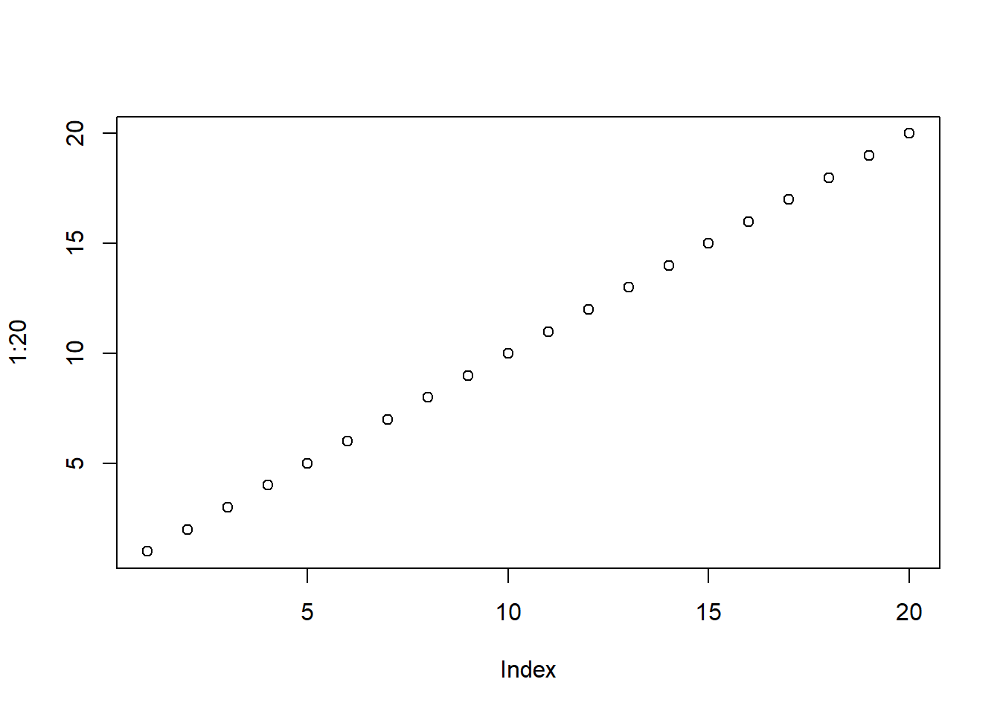

## The Pudding

https://pudding.cool/projects/heat-records-map/

This visualization is a interactive map that shows dots on every city and tracks the last time there was an all time high in a temperature.

Good

-   Interactive you can zoom in on the globe and zoom out wherever you want

-   Very interesting layout

-   Good labeling and data

Improvement

-   Allow for more searching of data and make the dots clickable to highlight them

## FiveThirtyEight

https://projects.fivethirtyeight.com/biden-approval-rating/?cid=rrpromo

This visualization is a interactive graph that shows dots marking polls done on Biden's approval rating and tracks it through out all of his presidency.

Good

-   Colors pop

-   Interactive design so you can see exactly the time his poll changed

-   Good labels on the end show the current polling

Improvements

-   Allow for more searching of data and make the dots clickable to highlight them

-   Allow for zooming in

## Our World in Data

https://ourworldindata.org/

This visualization is a interactive line graph that shows how many cases of covid the world had based off of the biggest countries that it had for data.

Good

-   Colors pop and are easy to coordinate with different countries

-   Interactive design so you can watch a little video that shows the graph as time went on

-   Good labels on the end show the different countries

Improvement

-   These are really good visualizations with lots of information I would just add the ability to so probability lines using ML


::: {.cell}

```{.r .cell-code}
plot(1:20)
```

::: {.cell-output-display}
{width=672}
:::
:::
